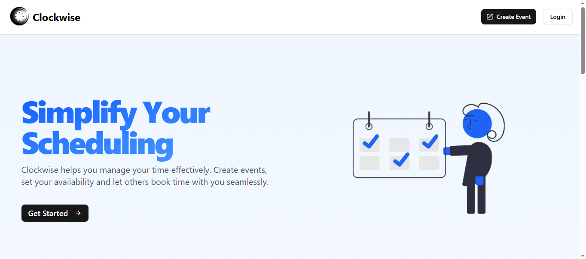
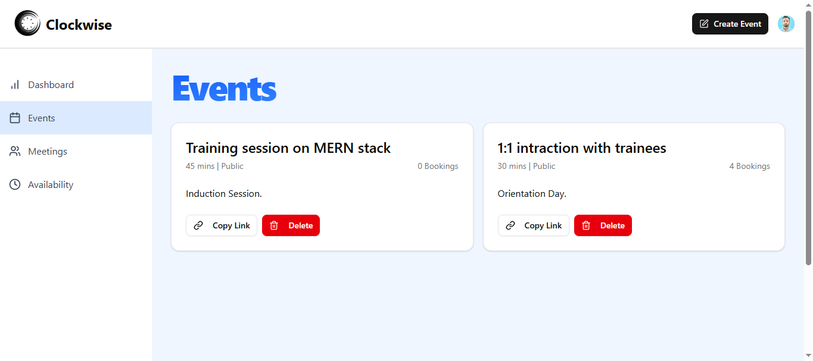
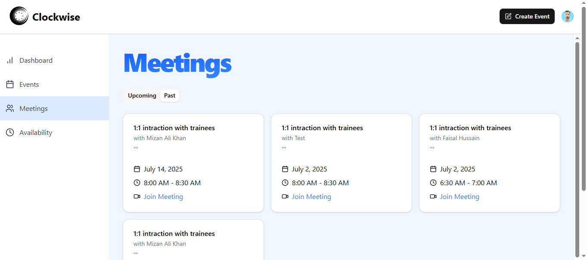
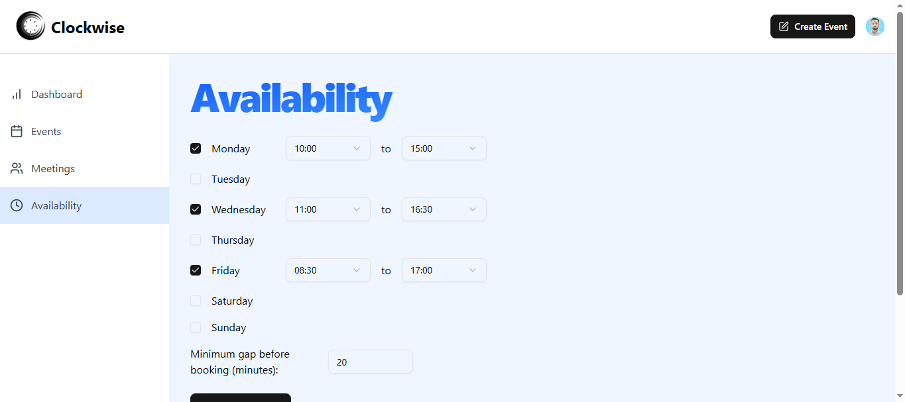
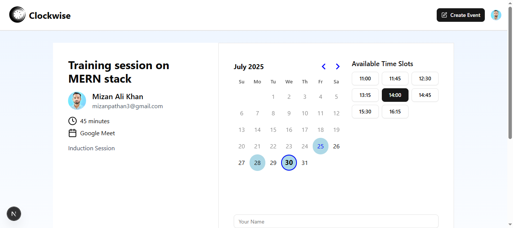

# Clockwise

**Clockwise** is a scheduling application that allows users to seamlessly book events, connect with Google Calendar, and generate Google Meet links for virtual meetings.

[Open Clockwise Web App](https://clockwise-eight.vercel.app/) (right-click to open in new tab)

## Features

- Schedule meetings via custom booking links

- Real-time Google Calendar integration

- Automatic Google Meet link generation

- Secure authentication using Clerk

- Elegant UI built with shadcn/ui

- PostgreSQL database hosted on NeonDB

- Serverless API routes with Next.js

## Tech Stack

**Client:** Next.js, TailwindCSS, React-hook-form

**Server:** Next.js App Router

**Authentication:** Clerk

**UI Components:** shadcn/ui

**Database:** PostgreSQL with Prisma ORM

**Integrations:** Google Calendar, Google Meet

**Deployment:** Vercel

## Screenshot

### Landing Page



### Events Page



### Meetings Page



### Availability Page



### Booking Page



## Installation

1. Clone the repository:

```bash
git clone https://github.com/Zaeden/Clockwise.git
cd Clockwise
```

2. Install dependencies

```bash
npm install
```

3. Setup .env file (use .env.example as reference)

```bash
cp .env.example .env.local
```

4. Run development server

```bash
npm run dev
```

## Deployment

**Frontend and Backend:** Hosted on Vercel
**Database:** Hosted on NeonDB
